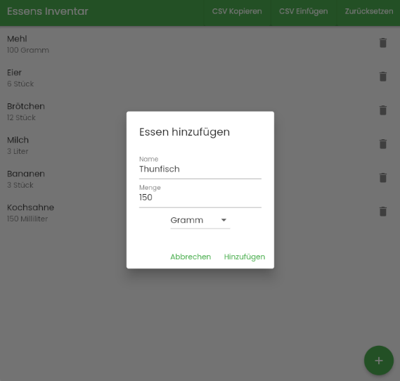

# Household Food Tracker Web App

Food Tracker is a german Flutter-based web application designed to help you keep track of food items in your household. The data is save on your browser.




## Features

- **Track Household Food Items**: Easily keep track of what's in your pantry or fridge.
- **Add New Food Items**: Quickly add items with their name, amount, and unit.
- **Update Existing Food Items**: Modify details of any item with a simple tap.
- **Export Food List**: Generate a CSV of your food items. This export can be used to ask systems like GPT-4 for recipe suggestions based on available ingredients.
- **Import Food List**: If you've saved an export, you can import it back into the app to restore your list.

## Getting Started

### Prerequisites

- [Flutter SDK](https://flutter.dev/docs/get-started/install)

### Installation

1. Clone the repository:

```bash
git clone https://github.com/stealthio/food_tracker.git
```

2. Navigate to the project directory:

```bash
cd food_tracker
```

3. Install the dependencies:

```bash
flutter pub get
```

4. Run the app:
```bash
flutter run web-server
```

## Usage

- Add new food items to your household list using the '+' button.
- Tap on an existing item to update its details.
- Swipe an item to delete it.
- Export your food list to ask intelligent systems for recipe suggestions, or simply to keep a backup.
- Import a previously saved list to restore your items.

## License

This project is licensed under the MIT License